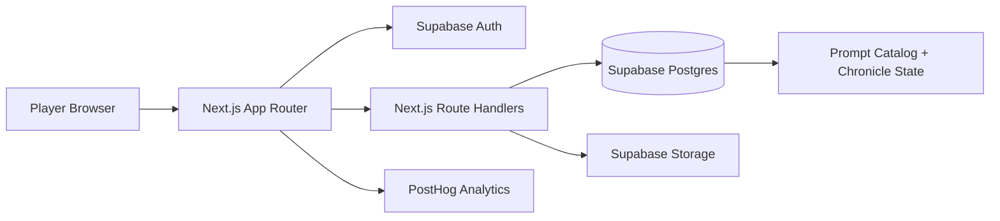

# PRD — Thousand Year Old Vampire: Digital Edition

## 1. Overview

### Product Summary
*Thousand Year Old Vampire: Digital Edition* helps curious solo players experience gothic journaling play through guided digital ritual. It is a web-first, cross-device adaptation of the original solitary game, built to remove analog friction without flattening the literary, lonely, and unsettling character of the source material. The product centers on guided setup, prompt-by-prompt writing, automatic state handling, and a living archive that makes memory erosion and reinvention tangible over time.

### Objective
This PRD covers the MVP defined in [docs/product-vision.md](/Users/gregoryhochard/Development/thousand_year_old_vampire/docs/product-vision.md): guided chronicle creation, active prompt play, automatic movement and state tracking, diary and memory overflow handling, archive/ledger views, session recap, and resumable persistence across devices. It explicitly excludes social features, monetization, content-authoring tools, AI writing assistance, and native app packaging.

### Market Differentiation
The technical implementation must deliver two things competitors and alternatives usually fail to combine: low-friction onboarding and high-fidelity literary tone. This means the product cannot behave like a PDF wrapper, a note-taking template, or a generic branching narrative engine. The implementation has to make the archive feel like a meaningful object, keep prompt play focused, and hide rules burden without hiding consequence.

### Magic Moment
The magic moment is when a new player moves from “I am learning a complicated solo game” to “I am already inside a vampire's life” within minutes. Technically, that requires a fast setup flow, a quiet auth path, instant save reliability, no dashboard detours before the first prompt, and immediate reflection of the player's writing in the chronicle state. If setup completion, prompt resolution, or archive reflection feels slow or brittle, the product misses its central promise.

### Success Criteria
- Time from successful sign-in to first resolved prompt: under 10 minutes for a new player, target under 6.
- Core P0 flows functional with test coverage: sign-in, chronicle creation, setup completion, prompt resolution, memory overflow, diary placement, recap, resume.
- First contentful paint under 2.5 seconds on Vercel production for core pages, with Largest Contentful Paint under 3 seconds on mobile broadband.
- No cross-user data leakage under row-level security.
- Responsive usability validated on current Safari iPhone dimensions and a standard desktop viewport.

## 2. Technical Architecture

### Architecture Overview


### Chosen Stack
| Layer | Choice | Rationale |
| --- | --- | --- |
| Frontend | Next.js | Best ecosystem for a solo build with strong routing, rendering options, and support for a polished web product that works well across desktop and mobile browsers. |
| Backend | Supabase | A conventional backend platform with auth, storage, and SQL-backed data that keeps the chronicle model explicit and durable without forcing custom backend plumbing. |
| Database | Supabase Database (PostgreSQL) | The natural fit for Supabase, with a clear relational model for chronicles, memories, prompts, traits, and session history. |
| Auth | Supabase Auth | Keeps authentication aligned with the chosen backend and supports private cross-device chronicles with row-level security. |
| Payments | None | The MVP is intentionally free; no billing scope is included. |

### Stack Integration Guide
Set up the stack in this order:

1. Initialize the Next.js app with App Router, TypeScript, Tailwind CSS, ESLint, and `src/` layout.
2. Install `@supabase/supabase-js` and `@supabase/ssr`, then create browser and server clients in `src/lib/supabase/`.
3. Create the Supabase project and configure email magic-link auth first. This keeps the MVP auth surface quiet and low-friction.
4. Add SQL migrations in `supabase/migrations/` for schema, enums, indexes, and row-level security policies.
5. Seed `prompt_catalog` from licensed source content through a dedicated SQL seed or script. Do not hard-code prompts into React files.
6. Build protected app routes under `src/app/(app)/` and public marketing routes under `src/app/(marketing)/`.
7. Add PostHog only after the core flow exists so instrumentation reflects real events, not placeholders.

Use Supabase SSR middleware to refresh auth cookies on every request to protected routes. Reads that hydrate major pages should happen on the server where possible. Writes should go through Next.js Route Handlers using `zod` validation and explicit transactional SQL or stored procedures when multiple chronicle entities must update together. The most important gotcha is atomicity: prompt resolution, memory changes, diary placement, and next-prompt movement must succeed or fail together.

Required environment variables:

- `NEXT_PUBLIC_SUPABASE_URL`
- `NEXT_PUBLIC_SUPABASE_ANON_KEY`
- `SUPABASE_SERVICE_ROLE_KEY`
- `NEXT_PUBLIC_SITE_URL`
- `NEXT_PUBLIC_POSTHOG_KEY`
- `NEXT_PUBLIC_POSTHOG_HOST`

### Repository Structure
```text
project-root/
├── docs/
│   ├── product-vision.md
│   ├── prd.md
│   ├── product-roadmap.md
│   ├── gtm.md
│   └── superpowers/specs/
├── public/
│   ├── textures/                # Optional paper/nocturne textures
│   └── icons/
├── scripts/
│   ├── validate-vision.js
│   └── seed-prompts.mjs         # Prompt import/seed helper
├── src/
│   ├── app/
│   │   ├── (marketing)/
│   │   │   ├── page.tsx
│   │   │   └── layout.tsx
│   │   ├── (auth)/
│   │   │   ├── sign-in/page.tsx
│   │   │   └── auth/callback/route.ts
│   │   ├── (app)/
│   │   │   ├── chronicles/page.tsx
│   │   │   ├── chronicles/new/page.tsx
│   │   │   ├── chronicles/[chronicleId]/play/page.tsx
│   │   │   ├── chronicles/[chronicleId]/archive/page.tsx
│   │   │   ├── chronicles/[chronicleId]/ledger/page.tsx
│   │   │   └── chronicles/[chronicleId]/recap/page.tsx
│   │   ├── api/
│   │   │   ├── chronicles/
│   │   │   ├── profile/
│   │   │   └── feedback/
│   │   ├── globals.css
│   │   └── layout.tsx
│   ├── components/
│   │   ├── ui/
│   │   ├── ritual/
│   │   ├── archive/
│   │   └── marketing/
│   ├── lib/
│   │   ├── auth/
│   │   ├── chronicles/
│   │   ├── prompts/
│   │   ├── recap/
│   │   ├── supabase/
│   │   └── validation/
│   ├── types/
│   │   ├── database.ts
│   │   └── chronicle.ts
│   └── proxy.ts
├── supabase/
│   ├── config.toml
│   ├── migrations/
│   └── seed.sql
├── tests/
│   ├── validate-vision.test.js
│   ├── integration/
│   └── e2e/
├── package.json
└── tsconfig.json
```

### Infrastructure & Deployment
Deploy the Next.js app to Vercel. Use Supabase Cloud for auth, database, and storage. Use PostHog Cloud for early analytics unless self-hosting already exists. Configure Vercel preview deployments for every branch. Production should use environment variables scoped by Vercel environment. Database migrations should run through Supabase CLI in CI before production deploys. Use a hobby or low-cost domain once a public beta exists, but keep staging behind preview URLs.

### Security Considerations
Use Supabase Auth with email magic links for the MVP. Every chronicle-bound table must include `user_id` directly or derive access through a parent chronicle row protected by row-level security. Never expose service-role credentials to the client. All write route handlers must validate payloads with `zod`, derive the acting user from the server session, and refuse writes where the authenticated user does not own the target chronicle. Prompt content should be served from protected database rows or server-loaded seed data, not embedded in public static bundles if licensing remains sensitive.

### Cost Estimate
For the first six months under 1,000 users, expected monthly cost is low:

- Vercel Hobby: `$0`
- Supabase Free: `$0` until limits are exceeded; likely upgrade path is Supabase Pro at `$25/month`
- PostHog Cloud: `$0` at low event volume
- Domain: approximately `$1–2/month` averaged annually

Reasonable early operating range: `$0–27/month`, excluding any legal/licensing costs.

## 3. Data Model

### Entity Definitions
Use PostgreSQL enums for durable state:

```sql
CREATE TYPE chronicle_status AS ENUM ('draft', 'active', 'completed', 'archived');
CREATE TYPE session_status AS ENUM ('in_progress', 'paused', 'closed');
CREATE TYPE memory_location AS ENUM ('mind', 'diary', 'forgotten');
CREATE TYPE trait_status AS ENUM ('active', 'checked', 'lost');
CREATE TYPE diary_status AS ENUM ('active', 'lost');
CREATE TYPE character_kind AS ENUM ('mortal', 'immortal');
CREATE TYPE character_status AS ENUM ('active', 'dead', 'lost');
```

Profiles map 1:1 with `auth.users`:

```sql
CREATE TABLE profiles (
  id UUID PRIMARY KEY REFERENCES auth.users(id) ON DELETE CASCADE,
  display_name TEXT NOT NULL,
  created_at TIMESTAMPTZ NOT NULL DEFAULT NOW(),
  updated_at TIMESTAMPTZ NOT NULL DEFAULT NOW()
);
```

Chronicles hold top-level session state:

```sql
CREATE TABLE chronicles (
  id UUID PRIMARY KEY DEFAULT gen_random_uuid(),
  user_id UUID NOT NULL REFERENCES profiles(id) ON DELETE CASCADE,
  title TEXT NOT NULL,
  vampire_name TEXT,
  status chronicle_status NOT NULL DEFAULT 'draft',
  current_prompt_number INTEGER NOT NULL DEFAULT 1,
  current_prompt_encounter INTEGER NOT NULL DEFAULT 1,
  current_session_id UUID,
  created_at TIMESTAMPTZ NOT NULL DEFAULT NOW(),
  updated_at TIMESTAMPTZ NOT NULL DEFAULT NOW(),
  last_played_at TIMESTAMPTZ
);
```

Prompt content is seeded and versioned separately:

```sql
CREATE TABLE prompt_catalog (
  prompt_number INTEGER NOT NULL,
  encounter_index INTEGER NOT NULL DEFAULT 1,
  prompt_markdown TEXT NOT NULL,
  prompt_version TEXT NOT NULL DEFAULT 'base',
  PRIMARY KEY (prompt_number, encounter_index)
);
```

Sessions capture resumable play slices:

```sql
CREATE TABLE sessions (
  id UUID PRIMARY KEY DEFAULT gen_random_uuid(),
  chronicle_id UUID NOT NULL REFERENCES chronicles(id) ON DELETE CASCADE,
  status session_status NOT NULL DEFAULT 'in_progress',
  started_at TIMESTAMPTZ NOT NULL DEFAULT NOW(),
  ended_at TIMESTAMPTZ,
  recap_markdown TEXT,
  snapshot_json JSONB NOT NULL DEFAULT '{}'::jsonb
);
```

Each resolved prompt becomes a `prompt_run`:

```sql
CREATE TABLE prompt_runs (
  id UUID PRIMARY KEY DEFAULT gen_random_uuid(),
  chronicle_id UUID NOT NULL REFERENCES chronicles(id) ON DELETE CASCADE,
  session_id UUID NOT NULL REFERENCES sessions(id) ON DELETE CASCADE,
  prompt_number INTEGER NOT NULL,
  encounter_index INTEGER NOT NULL,
  d10_roll INTEGER NOT NULL CHECK (d10_roll BETWEEN 1 AND 10),
  d6_roll INTEGER NOT NULL CHECK (d6_roll BETWEEN 1 AND 6),
  movement INTEGER NOT NULL,
  prompt_markdown TEXT NOT NULL,
  player_entry TEXT NOT NULL,
  experience_text TEXT NOT NULL,
  next_prompt_number INTEGER NOT NULL,
  created_at TIMESTAMPTZ NOT NULL DEFAULT NOW()
);
```

Memories and entries preserve the archive structure:

```sql
CREATE TABLE memories (
  id UUID PRIMARY KEY DEFAULT gen_random_uuid(),
  chronicle_id UUID NOT NULL REFERENCES chronicles(id) ON DELETE CASCADE,
  title TEXT NOT NULL,
  location memory_location NOT NULL DEFAULT 'mind',
  slot_index INTEGER CHECK (slot_index BETWEEN 1 AND 5),
  diary_id UUID,
  forgotten_at TIMESTAMPTZ,
  created_at TIMESTAMPTZ NOT NULL DEFAULT NOW(),
  updated_at TIMESTAMPTZ NOT NULL DEFAULT NOW()
);

CREATE TABLE memory_entries (
  id UUID PRIMARY KEY DEFAULT gen_random_uuid(),
  memory_id UUID NOT NULL REFERENCES memories(id) ON DELETE CASCADE,
  prompt_run_id UUID REFERENCES prompt_runs(id) ON DELETE SET NULL,
  position INTEGER NOT NULL CHECK (position BETWEEN 1 AND 3),
  entry_text TEXT NOT NULL,
  created_at TIMESTAMPTZ NOT NULL DEFAULT NOW()
);
```

Diary state is separate because there can only be one active diary:

```sql
CREATE TABLE diaries (
  id UUID PRIMARY KEY DEFAULT gen_random_uuid(),
  chronicle_id UUID NOT NULL REFERENCES chronicles(id) ON DELETE CASCADE,
  title TEXT NOT NULL,
  status diary_status NOT NULL DEFAULT 'active',
  created_at TIMESTAMPTZ NOT NULL DEFAULT NOW(),
  lost_at TIMESTAMPTZ
);
```

Skills, resources, characters, and marks remain separate tables for clarity:

```sql
CREATE TABLE skills (
  id UUID PRIMARY KEY DEFAULT gen_random_uuid(),
  chronicle_id UUID NOT NULL REFERENCES chronicles(id) ON DELETE CASCADE,
  label TEXT NOT NULL,
  description TEXT,
  status trait_status NOT NULL DEFAULT 'active',
  sort_order INTEGER NOT NULL DEFAULT 0,
  created_at TIMESTAMPTZ NOT NULL DEFAULT NOW(),
  updated_at TIMESTAMPTZ NOT NULL DEFAULT NOW()
);

CREATE TABLE resources (
  id UUID PRIMARY KEY DEFAULT gen_random_uuid(),
  chronicle_id UUID NOT NULL REFERENCES chronicles(id) ON DELETE CASCADE,
  label TEXT NOT NULL,
  description TEXT,
  is_stationary BOOLEAN NOT NULL DEFAULT FALSE,
  status trait_status NOT NULL DEFAULT 'active',
  sort_order INTEGER NOT NULL DEFAULT 0,
  created_at TIMESTAMPTZ NOT NULL DEFAULT NOW(),
  updated_at TIMESTAMPTZ NOT NULL DEFAULT NOW()
);

CREATE TABLE characters (
  id UUID PRIMARY KEY DEFAULT gen_random_uuid(),
  chronicle_id UUID NOT NULL REFERENCES chronicles(id) ON DELETE CASCADE,
  name TEXT NOT NULL,
  description TEXT NOT NULL,
  kind character_kind NOT NULL,
  status character_status NOT NULL DEFAULT 'active',
  introduced_at TIMESTAMPTZ NOT NULL DEFAULT NOW(),
  retired_at TIMESTAMPTZ
);

CREATE TABLE marks (
  id UUID PRIMARY KEY DEFAULT gen_random_uuid(),
  chronicle_id UUID NOT NULL REFERENCES chronicles(id) ON DELETE CASCADE,
  label TEXT NOT NULL,
  description TEXT NOT NULL,
  is_concealed BOOLEAN NOT NULL DEFAULT FALSE,
  is_active BOOLEAN NOT NULL DEFAULT TRUE,
  created_at TIMESTAMPTZ NOT NULL DEFAULT NOW()
);
```

Use a generic event log for recap and archive highlighting:

```sql
CREATE TABLE archive_events (
  id UUID PRIMARY KEY DEFAULT gen_random_uuid(),
  chronicle_id UUID NOT NULL REFERENCES chronicles(id) ON DELETE CASCADE,
  session_id UUID REFERENCES sessions(id) ON DELETE SET NULL,
  event_type TEXT NOT NULL,
  summary TEXT NOT NULL,
  metadata JSONB NOT NULL DEFAULT '{}'::jsonb,
  created_at TIMESTAMPTZ NOT NULL DEFAULT NOW()
);
```

### Relationships
- `profiles` 1:many `chronicles`
- `chronicles` 1:many `sessions`, `prompt_runs`, `memories`, `skills`, `resources`, `characters`, `marks`, `archive_events`
- `sessions` 1:many `prompt_runs`
- `diaries` 1:many `memories` where `memories.location = 'diary'`
- `memories` 1:many `memory_entries`
- `prompt_runs` 1:1 or 1:many `memory_entries` depending on whether the resulting experience creates a new memory or appends to an existing one

Cascade delete from `chronicles` to all child entities. Use `SET NULL` where historical rows should remain after a relationship disappears, such as `prompt_runs` referenced by `memory_entries`.

### Indexes
```sql
CREATE INDEX idx_chronicles_user_id ON chronicles(user_id, updated_at DESC);
CREATE INDEX idx_sessions_chronicle_status ON sessions(chronicle_id, status);
CREATE INDEX idx_prompt_runs_chronicle_created_at ON prompt_runs(chronicle_id, created_at DESC);
CREATE INDEX idx_memories_chronicle_location ON memories(chronicle_id, location, slot_index);
CREATE UNIQUE INDEX idx_memories_mind_slot_unique ON memories(chronicle_id, slot_index) WHERE location = 'mind';
CREATE UNIQUE INDEX idx_active_diary_unique ON diaries(chronicle_id) WHERE status = 'active';
CREATE INDEX idx_archive_events_chronicle_created_at ON archive_events(chronicle_id, created_at DESC);
CREATE INDEX idx_characters_chronicle_status ON characters(chronicle_id, status);
```

These indexes support the main read paths: chronicle list, current session lookup, archive rendering, in-mind memory layout, and recap generation.

## 4. API Specification

### API Design Philosophy
Use REST-style Next.js Route Handlers under `src/app/api/` with JSON request and response bodies. Authentication is cookie-based through Supabase SSR. Every handler should derive the authenticated user on the server, validate inputs with `zod`, and return standard error shapes:

```json
{ "error": "Validation failed", "details": [{ "path": "title", "message": "Required" }] }
```

Pagination is cursor-based for archive events and prompt history using `created_at` plus `id`. Core chronicle pages should prefer server-rendered initial data, then progressively fetch smaller updates client-side as needed.

### Endpoints
`GET /api/profile`  
Auth: Required  
Response 200: `{ id, displayName, createdAt }`

`PATCH /api/profile`  
Auth: Required  
Body: `{ displayName: string }`  
Response 200: `{ id, displayName, updatedAt }`

`GET /api/chronicles`  
Auth: Required  
Response 200: `{ chronicles: [{ id, title, status, currentPromptNumber, lastPlayedAt, updatedAt }] }`

`POST /api/chronicles`  
Auth: Required  
Body: `{ title: string }`  
Response 201: `{ id, title, status: "draft", currentPromptNumber: 1 }`

`GET /api/chronicles/:chronicleId`  
Auth: Required  
Response 200: `{ chronicle, activeSession, latestRecap }`

`PATCH /api/chronicles/:chronicleId`  
Auth: Required  
Body: `{ title?: string, vampireName?: string, status?: "draft" | "active" | "completed" | "archived" }`  
Response 200: `{ chronicle }`

`POST /api/chronicles/:chronicleId/setup/complete`  
Auth: Required  
Body:
```json
{
  "mortalSummary": "string",
  "initialSkills": [{ "label": "string", "description": "string" }],
  "initialResources": [{ "label": "string", "description": "string", "isStationary": false }],
  "initialCharacters": [{ "name": "string", "description": "string", "kind": "mortal" }],
  "immortalCharacter": { "name": "string", "description": "string", "kind": "immortal" },
  "mark": { "label": "string", "description": "string", "isConcealed": true },
  "setupMemories": [{ "title": "string", "entryText": "string" }]
}
```  
Response 200: `{ chronicleId, currentPromptNumber, createdEntities, nextRoute: "/chronicles/:id/play" }`

`POST /api/chronicles/:chronicleId/sessions`  
Auth: Required  
Body: `{ mode: "start" | "resume" }`  
Response 200: `{ sessionId, status, recap, currentPrompt }`

`GET /api/chronicles/:chronicleId/play`  
Auth: Required  
Response 200:
```json
{
  "chronicle": { "id": "uuid", "title": "string", "currentPromptNumber": 12, "currentPromptEncounter": 1 },
  "prompt": { "promptNumber": 12, "encounterIndex": 1, "markdown": "..." },
  "summary": { "memoriesInMind": 4, "activeDiary": true }
}
```

`POST /api/chronicles/:chronicleId/play/resolve`  
Auth: Required  
Body:
```json
{
  "sessionId": "uuid",
  "playerEntry": "string",
  "experienceText": "string",
  "memoryDecision": {
    "mode": "append-existing" | "create-new" | "forget-existing" | "move-to-diary",
    "memoryId": "uuid",
    "targetMemoryId": "uuid"
  },
  "traitMutations": {
    "skills": [{ "id": "uuid", "action": "check" | "lose" }],
    "resources": [{ "id": "uuid", "action": "lose" }],
    "characters": [{ "id": "uuid", "action": "age-out" | "lose" }],
    "marks": [{ "id": "uuid", "action": "update", "description": "string" }]
  }
}
```  
Response 200:
```json
{
  "promptRunId": "uuid",
  "rolled": { "d10": 6, "d6": 3, "movement": 3 },
  "nextPrompt": { "promptNumber": 15, "encounterIndex": 1 },
  "archiveEvents": [{ "eventType": "memory_forgotten", "summary": "..." }]
}
```

`POST /api/chronicles/:chronicleId/memories/overflow`  
Auth: Required  
Body: `{ mode: "forget" | "move-to-diary", memoryId: "uuid", diaryTitle?: "string" }`  
Response 200: `{ memoriesInMind, diaryState, archiveEvent }`

`GET /api/chronicles/:chronicleId/archive?cursor=<cursor>`  
Auth: Required  
Response 200: `{ memories, diary, promptRuns, archiveEvents, nextCursor }`

`GET /api/chronicles/:chronicleId/ledger`  
Auth: Required  
Response 200: `{ skills, resources, characters, marks }`

`PATCH /api/chronicles/:chronicleId/characters/:characterId`  
Auth: Required  
Body: `{ description?: string, status?: "active" | "dead" | "lost" }`  
Response 200: `{ character }`

`PATCH /api/chronicles/:chronicleId/skills/:skillId`  
Auth: Required  
Body: `{ status: "active" | "checked" | "lost" }`  
Response 200: `{ skill }`

`PATCH /api/chronicles/:chronicleId/resources/:resourceId`  
Auth: Required  
Body: `{ status: "active" | "checked" | "lost" }`  
Response 200: `{ resource }`

`PATCH /api/chronicles/:chronicleId/marks/:markId`  
Auth: Required  
Body: `{ description?: string, isConcealed?: boolean, isActive?: boolean }`  
Response 200: `{ mark }`

`GET /api/chronicles/:chronicleId/recap`  
Auth: Required  
Response 200: `{ recapMarkdown, latestEvents, currentPromptNumber }`

`POST /api/feedback`  
Auth: Required  
Body: `{ chronicleId?: "uuid", message: "string", category: "bug" | "tone" | "feature" }`  
Response 201: `{ id, createdAt }`

## 5. User Stories

### Epic: Access & Chronicle Setup
**US-001: Start a new chronicle**  
As Jules, I want to create a chronicle and move through guided setup so that I can begin writing without reading an external rules reference.

Acceptance Criteria:
- [ ] Given I am authenticated, when I create a chronicle, then I land in guided setup rather than a generic dashboard.
- [ ] Given I complete setup, when I submit the final step, then my initial memories, traits, characters, mark, and immortal origin are persisted.
- [ ] Edge case: if I leave setup mid-way, the partial chronicle remains resumable as a draft.

**US-002: Quiet sign-in**  
As Jules, I want a low-friction sign-in flow so that accounts do not break the ritual before the first prompt.

Acceptance Criteria:
- [ ] Given I request a magic link, when I complete authentication, then I return to the route I started from.
- [ ] Given my session expires, when I revisit a protected route, then I am redirected to sign-in with a clear, non-jarring explanation.
- [ ] Edge case: if auth callback fails, the UI offers retry without losing my original destination.

### Epic: Prompt Play
**US-003: Resolve a prompt**  
As Jules, I want to answer one prompt at a time in a focused writing view so that the product feels like a ritual instead of a system console.

Acceptance Criteria:
- [ ] Given an active chronicle, when I open play, then I see the current prompt, brief supporting context, and a writing surface.
- [ ] Given I submit an entry, when the response is valid, then the app records the experience, rolls movement, and advances the chronicle atomically.
- [ ] Edge case: if submission fails, my unsent text remains available locally until retry.

**US-004: Experience consequence through archive state**  
As Jules, I want memory and trait consequences to feel meaningful so that the mechanics deepen the fiction instead of interrupting it.

Acceptance Criteria:
- [ ] Given a prompt changes memories or traits, when I submit the entry, then I see a brief consequence summary tied to the chronicle.
- [ ] Given a skill is checked or lost, when I open the ledger, then its state is visually distinct and readable.
- [ ] Edge case: if a memory is forgotten, it remains legible in historical views unless a prompt explicitly removes it.

### Epic: Archive & Return
**US-005: Manage memory overflow**  
As Jules, I want the app to guide me through forgetting or diary placement when memory is full so that I do not need to remember special-case rules.

Acceptance Criteria:
- [ ] Given I would exceed five in-mind memories, when I continue, then the UI presents only legal overflow choices.
- [ ] Given I move a memory to a diary, when the operation succeeds, then the memory is removed from in-mind slots and locked against further entry additions.
- [ ] Edge case: if no diary exists, the product can create one in the same flow.

**US-006: Return after a gap**  
As Jules, I want a recap before resuming so that interrupted play still feels coherent.

Acceptance Criteria:
- [ ] Given I reopen a chronicle after time away, when I choose resume, then I see a short recap and current prompt context.
- [ ] Given I completed a previous session, when I review recap, then the latest archive events and prompt movement are included.
- [ ] Edge case: if no recap exists yet, the resume view falls back to current chronicle state without leaving an empty page.

### Epic: Existing Fans & Reviewers
**US-007: Reread the chronicle**  
As Rowan, I want to browse the archive and ledger so that I can experience the full weight of the vampire's history, not just the current prompt.

Acceptance Criteria:
- [ ] Given a chronicle with history, when I open archive, then I can read memories, prompt runs, and diary state in chronological context.
- [ ] Given I open ledger, when I inspect characters and resources, then current and lost states remain legible.
- [ ] Edge case: if the chronicle is new, the archive presents an atmospheric empty state instead of blank scaffolding.

## 6. Functional Requirements

**FR-001: Email magic-link authentication**  
Priority: P0  
Description: Implement Supabase Auth using email magic links with protected app routes and destination-aware redirect handling.  
Acceptance Criteria:
- Route protection exists for all authenticated pages.
- Users return to the route they intended after auth.
- Failed callbacks present a retry path.
Related Stories: US-001, US-002

**FR-002: Chronicle creation and draft persistence**  
Priority: P0  
Description: Users can create, rename, and reopen draft or active chronicles from a chronicle list screen.  
Acceptance Criteria:
- New chronicles default to `draft`.
- Drafts appear in the chronicle list with updated timestamps.
- Renaming updates immediately without page reload.
Related Stories: US-001

**FR-003: Guided setup flow**  
Priority: P0  
Description: A multi-step setup flow collects mortal history, initial traits, characters, mark, and becoming-undead experience.  
Acceptance Criteria:
- Setup can be completed in one flow without external rules reference.
- All required entities persist atomically.
- Partially completed setup remains resumable.
Related Stories: US-001

**FR-004: Prompt loading and active play surface**  
Priority: P0  
Description: The play screen loads the current prompt, surrounding context, and writing form for the active chronicle.  
Acceptance Criteria:
- Prompt content is loaded from `prompt_catalog`.
- Writing form preserves content during transient UI refresh.
- Active session state remains consistent across reloads.
Related Stories: US-003

**FR-005: Prompt resolution transaction**  
Priority: P0  
Description: Submitting a prompt response creates a prompt run, records experience text, applies trait changes, resolves movement, and updates next prompt position in one transaction.  
Acceptance Criteria:
- Partial writes are impossible.
- Roll values are stored with the prompt run.
- Next prompt state is visible immediately after success.
Related Stories: US-003, US-004

**FR-006: Memory capacity management**  
Priority: P0  
Description: The system enforces up to five in-mind memories and up to three entries per memory.  
Acceptance Criteria:
- Illegal over-capacity states cannot be saved.
- Overflow triggers an in-context decision UI.
- Memory entry positions remain ordered.
Related Stories: US-005

**FR-007: Diary lifecycle**  
Priority: P0  
Description: Support one active diary per chronicle, movement of memories into the diary, and diary loss handling.  
Acceptance Criteria:
- Only one active diary exists at a time.
- Diary-stored memories reject new entries.
- Diary loss updates associated memories and archive events.
Related Stories: US-005, US-007

**FR-008: Trait ledger views**  
Priority: P0  
Description: Expose current and lost states for skills, resources, characters, and marks in a dedicated ledger view.  
Acceptance Criteria:
- Lost or checked states remain readable.
- Mortal and immortal characters are distinguishable.
- Ledger loads within one navigation step from play.
Related Stories: US-004, US-007

**FR-009: Archive view**  
Priority: P0  
Description: Provide an archive surface showing memories, diary contents, prompt history, and notable chronicle events.  
Acceptance Criteria:
- Archive supports pagination for long chronicles.
- Diary and forgotten memories are visually distinct.
- Prompt history can be read without leaving archive.
Related Stories: US-006, US-007

**FR-010: Session recap and resume**  
Priority: P0  
Description: Each session can generate or update a recap summary that is shown before resuming after a gap.  
Acceptance Criteria:
- Recap includes recent prompt runs and major archive events.
- Resume flow routes directly back into active play.
- Missing recap states degrade gracefully.
Related Stories: US-006

**FR-011: Responsive writing experience**  
Priority: P0  
Description: The active play experience must support mobile and desktop without collapsing into dense UI.  
Acceptance Criteria:
- Writing surface remains readable at 390px width.
- Archive/ledger shift to stacked panels on smaller screens.
- Touch targets meet accessibility thresholds.
Related Stories: US-003, US-006

**FR-012: Atmospheric landing and chronicle list**  
Priority: P1  
Description: Provide a public landing page plus an authenticated chronicle list that clearly distinguishes “start,” “resume,” and “return.”  
Acceptance Criteria:
- Landing page communicates value proposition and tone.
- Returning users can reopen the last active chronicle in one click.
- Empty states match the product voice.
Related Stories: US-001, US-006

**FR-013: Feedback capture**  
Priority: P1  
Description: Authenticated users can submit lightweight feedback about bugs, tone mismatches, or feature requests.  
Acceptance Criteria:
- Feedback is stored server-side with optional chronicle context.
- Submission success is acknowledged quietly.
- Form does not interrupt active play.
Related Stories: US-006

**FR-014: Analytics instrumentation**  
Priority: P1  
Description: Instrument sign-in, chronicle creation, setup completion, first prompt resolution, archive open, and second-session return events.  
Acceptance Criteria:
- Events fire only once per meaningful action.
- No prompt or journal text is sent to analytics.
- Consent and privacy copy are present if required.
Related Stories: US-001, US-006

**FR-015: Unsaved draft protection**  
Priority: P1  
Description: The active writing surface preserves unsent text through route refreshes or transient network errors.  
Acceptance Criteria:
- Draft entry persists locally until success.
- Retry flow restores the unsent text.
- Successful submission clears local draft cache.
Related Stories: US-003

**FR-016: Accessibility and reduced motion support**  
Priority: P1  
Description: All core flows support keyboard access, screen-reader labels, and reduced motion preferences.  
Acceptance Criteria:
- No keyboard traps exist.
- Focus order is logical across setup, play, archive, and recap.
- Motion-heavy transitions are disabled when requested.
Related Stories: US-001 through US-007

**FR-017: Prompt catalog seeding and versioning**  
Priority: P1  
Description: Prompt content is seeded into the database with version metadata so updates can be managed intentionally.  
Acceptance Criteria:
- Prompt rows are reproducibly seeded.
- Seed process is documented.
- Prompt content is not duplicated inside UI code.
Related Stories: US-003

**FR-018: Archive event generation**  
Priority: P1  
Description: Important chronicle changes create event log entries used by recap, archive, and return surfaces.  
Acceptance Criteria:
- Memory overflow, diary creation, diary loss, trait loss, and prompt completion generate events.
- Event summaries follow the brand voice.
- Recap rendering can rely on event data.
Related Stories: US-004, US-006, US-007

## 7. Non-Functional Requirements

### Performance
- LCP under 3 seconds on mobile broadband for landing, chronicle list, and play routes.
- Route-handler p95 under 300ms for standard reads and under 700ms for prompt resolution transactions.
- Initial JS for play route under 250KB gzipped excluding framework runtime.

### Security
- Row-level security enabled on every chronicle-bound table.
- No service-role credentials in client bundles.
- Auth callbacks validate expected redirect origins using `NEXT_PUBLIC_SITE_URL`.
- All write handlers validate request bodies with `zod`.

### Accessibility
- WCAG 2.1 AA target for all launch routes.
- Full keyboard navigation for setup, play, archive, recap, and chronicle list.
- Focus ring visible against both light surfaces and nocturne surfaces.
- Minimum touch target 44x44 pixels.

### Scalability
- Support at least 100 concurrent users on hobby tiers without route failures.
- Archive pagination handles chronicles with 1,000+ prompt runs without page crashes.
- Database indexes keep chronicle list and archive fetches under 300ms p95 at low scale.

### Reliability
- 99.5% uptime target for public beta.
- Prompt resolution is transactional and idempotent against duplicate submit attempts.
- User drafts survive transient network failures until successful save or explicit discard.

## 8. UI/UX Requirements

### Screen: Landing
Route: `/`  
Purpose: Explain the product, establish tone, and direct the user to start or sign in.  
Layout: Hero, short value explanation, atmospheric product surfaces, and a clean primary CTA.

States:
- **Empty:** Not applicable.
- **Loading:** Lightweight skeleton for any auth-aware CTA swap.
- **Populated:** Full marketing content with start/resume CTA.
- **Error:** If auth lookup fails, default to start/sign-in CTA without blocking the page.

Key Interactions:
- Start CTA routes unauthenticated users to sign-in, authenticated users to chronicle creation.
- Resume CTA returns authenticated users to chronicle list or most recent chronicle.

Components Used: `HeroPanel`, `PrimaryButton`, `TextBlock`, `ArchivePreview`

### Screen: Chronicle List
Route: `/chronicles`  
Purpose: Show draft and active chronicles, with start/resume affordances.  
Layout: Minimal top bar, chronicle cards, and primary create action.

States:
- **Empty:** Atmospheric empty state inviting the user to begin their first chronicle.
- **Loading:** Card skeletons.
- **Populated:** List of chronicle cards sorted by `updated_at DESC`.
- **Error:** Quiet retry panel with no raw error dumps.

Key Interactions:
- Create chronicle opens `/chronicles/new`.
- Selecting a chronicle routes to play or setup depending on status.

Components Used: `ChronicleCard`, `SectionHeader`, `EmptyState`, `QuietAlert`

### Screen: Guided Setup
Route: `/chronicles/new` and `/chronicles/[chronicleId]/setup`  
Purpose: Lead the player through mortal life, traits, relationships, curse, and initial memories.  
Layout: Single-column narrative form with a stepper that feels editorial rather than procedural.

States:
- **Empty:** N/A.
- **Loading:** Step shell with preserved navigation skeleton.
- **Populated:** Active step with progress and calm inline guidance.
- **Error:** Inline field validation plus route-level save error banner.

Key Interactions:
- Next/previous step navigation preserves entered content.
- Final submit atomically creates all setup entities and routes to play.

Components Used: `SetupStepper`, `RitualTextarea`, `ChoiceList`, `InlineValidation`

### Screen: Active Prompt
Route: `/chronicles/[chronicleId]/play`  
Purpose: Present the current prompt and collect the player's response.  
Layout: Prompt header, prompt body, writing surface, compact current-state summary, and post-submit consequence block.

States:
- **Empty:** N/A once setup is complete.
- **Loading:** Prompt skeleton and disabled writing surface.
- **Populated:** Prompt text, entry form, compact memory count, and submit action.
- **Error:** Draft-preserving error panel with retry.

Key Interactions:
- Submit resolves prompt and shows next prompt state without losing context.
- Memory overflow triggers modal or inline panel without leaving the route.

Components Used: `PromptCard`, `RitualTextarea`, `MemoryMeter`, `ConsequencePanel`

### Screen: Archive
Route: `/chronicles/[chronicleId]/archive`  
Purpose: Let the player reread memories, prompt history, diary contents, and archive events.  
Layout: Memory stack first, diary panel second, event timeline last. On mobile, sections collapse into stacked accordion panels.

States:
- **Empty:** Early-chronicle archive message with first memory highlights.
- **Loading:** Skeleton rows/cards.
- **Populated:** Chronological archive with pagination.
- **Error:** Inline retry at the section level.

Key Interactions:
- Expand/collapse memory cards.
- Paginate older prompt runs and archive events.

Components Used: `MemoryCard`, `DiaryPanel`, `EventTimeline`, `PaginationButton`

### Screen: Ledger
Route: `/chronicles/[chronicleId]/ledger`  
Purpose: Surface current and lost skills, resources, characters, and marks in one place.  
Layout: Four vertically stacked sections on mobile, two-column grouping on desktop if space allows.

States:
- **Empty:** Setup-specific empty state until chronicle creation is complete.
- **Loading:** Section skeletons.
- **Populated:** Distinct groups with visual treatment for active, checked, lost, dead, and concealed states.
- **Error:** Section-level retry.

Key Interactions:
- Expand item descriptions.
- Edit character descriptions or mark concealment state where allowed.

Components Used: `LedgerSection`, `TraitItem`, `CharacterCard`

### Screen: Recap
Route: `/chronicles/[chronicleId]/recap`  
Purpose: Re-immerse the player before resuming a chronicle.  
Layout: Summary text, recent archive events, current prompt position, and resume button.

States:
- **Empty:** Fallback recap derived from latest prompt run and chronicle title.
- **Loading:** Skeleton text and action button.
- **Populated:** Recap prose plus concise state summary.
- **Error:** Retry or direct resume path.

Key Interactions:
- Resume routes directly to active prompt.
- View archive opens in a new navigation step without losing return context.

Components Used: `RecapBlock`, `EventList`, `PrimaryButton`

## 9. Design System

### Color Tokens
Implement the color tokens from [docs/product-vision.md](/Users/gregoryhochard/Development/thousand_year_old_vampire/docs/product-vision.md) using CSS custom properties in `src/app/globals.css`. The minimum required tokens are: `--color-bg`, `--color-surface`, `--color-surface-muted`, `--color-ink`, `--color-ink-muted`, `--color-nocturne`, `--color-oxblood`, `--color-gold`, `--color-success`, `--color-warning`, `--color-error`, and `--color-info`.

### Typography Tokens
Load `Cormorant Garamond`, `Newsreader`, and `IBM Plex Mono` using `next/font/google`. Expose them as `--font-heading`, `--font-body`, and `--font-mono`. Use heading classes for section titles and body typography for prompt and archive prose; do not reuse heading font for long-form body copy.

### Spacing Tokens
Define spacing tokens in Tailwind from 4px to 64px using the design token names in the vision doc. Enforce `max-w-prose` style limits on writing surfaces and archive prose panels. Default container padding should be `px-4`, `sm:px-6`, `lg:px-10`.

### Component Specifications
- Buttons: primary button uses `bg-nocturne text-surface`; destructive uses `bg-oxblood text-surface`.
- Inputs and textareas: `bg-surface border border-surface-muted`, generous padding, focus ring using `--color-gold`.
- Cards/panels: `bg-surface`, subtle border or tonal shift, optional `shadow-float` only for elevated overlays.
- Alerts: avoid saturated green success banners; use quiet tonal confirmation with icon and short copy.

### Tailwind Configuration
Extend Tailwind theme with:
- `colors`: tokens above
- `fontFamily`: `heading`, `body`, `mono`
- `boxShadow.float`
- `borderRadius.panel`, `borderRadius.control`
- `transitionDuration.fast`, `transitionDuration.base`
- `transitionTimingFunction.standard`

## 10. Auth Implementation

Use Supabase email magic-link auth as the only MVP sign-in method. The auth flow should be:

1. User enters email on `/sign-in`.
2. Supabase sends magic link.
3. Auth callback route exchanges the code for a session and redirects to the originally requested route.
4. A `profiles` row is created on first login through a server-side insert if one does not already exist.

Use middleware to refresh auth sessions for protected routes. Keep auth UI minimal and inline with the product tone. No password reset, MFA, or social login in the MVP.

## 11. Payment Integration

There is no payment integration in the MVP. Do not add placeholder checkout routes, billing tables, or gated-plan UI. If monetization is revisited later, add it as a new product decision after usage and rights clarity justify it.

## 12. Edge Cases & Error Handling

- If prompt resolution fails, preserve the player's unsent text locally and show a retry path.
- If a duplicate prompt submission arrives, treat it as idempotent by session plus prompt number.
- If a player fills a memory beyond three entries, block the operation and return them to legal in-context choices.
- If a player tries to add a diary when one already exists, route the flow to the active diary instead of creating another.
- If a mortal character ages out, keep them readable in the ledger and archive.
- If the current prompt is missing from `prompt_catalog`, show a blocking system error with a support path; this should be impossible in normal seeded data.
- If session recap generation has not yet occurred, synthesize a recap from latest events and prompt runs instead of showing a blank page.
- If auth expires mid-flow, save local draft content and return the user to sign-in with destination preserved.

## 13. Dependencies & Integrations

- `next`, `react`, `react-dom` for application shell
- `@supabase/supabase-js`, `@supabase/ssr` for auth, database, and storage access
- `zod` for API payload validation
- `react-hook-form` for guided setup forms
- `class-variance-authority`, `clsx`, `tailwind-merge` for component styling ergonomics
- `lucide-react` for iconography
- `date-fns` for human-readable archive and recap dates
- `posthog-js` and `posthog-node` for product analytics
- `vitest`, `@testing-library/react`, `@testing-library/jest-dom` for unit/component tests
- `@playwright/test` for end-to-end flows

## 14. Out of Scope

This PRD does not cover licensing negotiation or legal review for the adaptation. It also does not cover community features, public chronicle sharing, prompt authoring, content expansion packs, AI-assisted prose generation, monetization, or native packaging. Those are separate future decisions, not quiet stretch goals.

## 15. Open Questions

- Is the project intended to distribute original prompt text publicly, or must beta access and prompt storage be constrained until rights are clear?
- Should the MVP allow one local draft step before sign-in to reduce auth friction further, or is account-first acceptable?
- Does the first release need full chronicle export, or is rereading inside the archive sufficient?
- Should recap prose be entirely system-generated from structured events, or may it use templated narrative stitching for better tone?
